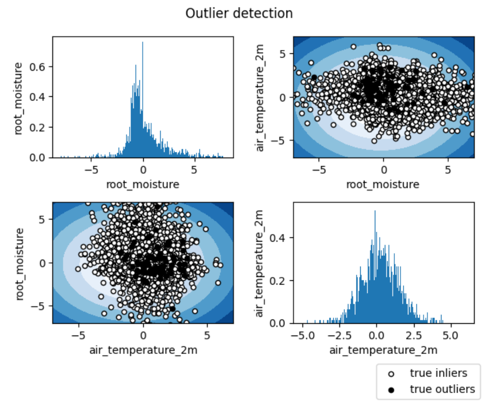

.. role:: raw-html(raw)
   :format: html

Visualizations
===============

The toolbox provides a wide range of visualizations according to the task and data characteristics. Visualizations can be activated or deactivated through the parameter :raw-html:`activate` of the configuration file. 

Outlier Detection
~~~~~~~~~~~~~~~~~~

For Outlier Detection, the toolbox generates a scatter plot of the true inliers and true outliers for each pair of variables, including the contour of the learned decision fucntion. Any observation belonging to the distribution is referred to as an inlier and any outlying point is referred to as an outlier. The
variables' distributions is plotted on the diagonal of the generated matrix of plots. In case the user chooses to work with a unique input variable, a single plot with the data distribution is created.

The proper functioning of this stage depends on several variables defined in the Data section of the configuration file:

    - :raw-html:`features`: List of variables (strings) included in the database. (e.g. ['air_temperature_2m', 'precipitation', 'root_moisture'])
    - :raw-html:`features_selected`: List of selected variables (ints) from the available features list. (e.g. [0,2])

Classification
~~~~~~~~~~~~~~~~

For Classification, the toolbox generates the following plots according to the characteristics of the input data:

    - Time-series data (1D): 
        - Pixel-wise detection signals (see image A).
        - If :raw-html:`time_aggregation: True`, detection signals averaged through all pixels (see image A)
        - If :raw-html:`spatial_aggregation: (H,W,T) `, with H = heigh (int), W = width (int) and T = time (int), probabilistic spatial map of the detection per time step (see image B). To deactivate, set the parameter to False. 
        - Confusion matrix (see image D).

    - Spatial data (2D):
        - Probabilistic map per time step (see image B)
        - Categorical map per time step (see image C)
        - If :raw-html:`time_aggregation: True`, detection signals averaged through all pixels (see image A)
        - Confusion matrix (see image D)
    
    - Spatiotemporal data (3D):
        - Probabilistic map per time step (see image B)
        - Categorical map per time step (see image C)
        - If :raw-html:`time_aggregation: True`, detection signals averaged through all pixels (see image A)
        - Confusion matrix (see image D)

This stage hangs on the following variables defined in the :raw-html:`data` section of the configuration file:

    - :raw-html:`num_classes`: Number of classes in the classification task (non-event included).
    - :raw-html:`lat_slice_test`: Min/max latitude coordinates (test). This parameter is optional for 1D, mandatory for 2D-3D. Defined as an String: "min_lat, max_lat".       
    - :raw-html:`lon_slice_test`: Min/max longitude coordinates (test). This parameter is optional for 1D, mandatory for 2D-3D. Defined as an String: "min_lon, max_lon".       

 
.. container:: twocol

    .. container:: leftsidetop

        (A) Example temporal plot:

        .. image:: _static/images/temporal_signal.png
            :width: 310
            :align: left
            :alt: 
    
    
    .. container:: rightsidetop

        (B) Example confusion matrix:

        .. image:: _static/images/confusion_matrix.png
            :width: 300
            :align: left
            :alt: 

.. container:: twocol

    .. container:: leftsidebottom

        (C) Example categorical spatial plot:

        .. image:: _static/images/categorical_map.png
            :width: 300
            :align: left
            :alt: 
    
    .. container:: rightsidebottom

        (D) Example probabilistic spatial plot:

        .. image:: _static/images/probabilistic_map.png
            :width: 300
            :align: left
            :alt:

Impact Assessment 
~~~~~~~~~~~~~~~~~~

The Impact Assessment only provides visualizations when working with spatial data (2D) or spatiotemporal data (3D). In these cases, the toolbox provides the prediction map. If a Gaussian Process Layer is used in the model, the uncertainty maps are also generated.

This stage hangs on the following variables defined in the :raw-html:`data` section of the configuration file:

    - :raw-html:`num_targets`: Number of targets in the regression task.
    - :raw-html:`lat_slice_test`: Min/max latitude coordinates (test). This parameter is optional for 1D, mandatory for 2D-3D. Defined as an String: "min_lat, max_lat".       
    - :raw-html:`lon_slice_test`: Min/max longitude coordinates (test). This parameter is optional for 1D, mandatory for 2D-3D. Defined as an String: "min_lon, max_lon".       
