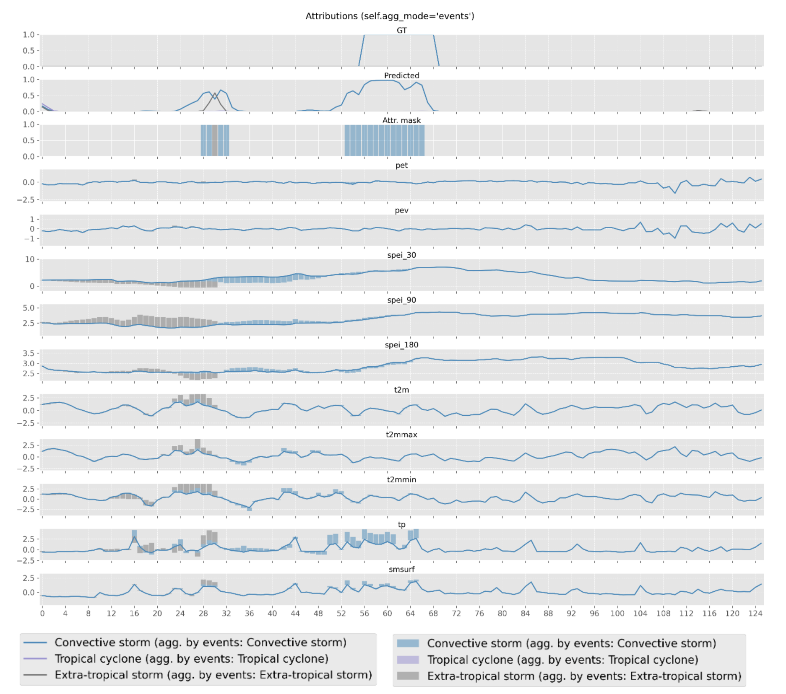

.. role:: raw-html(raw)
   :format: html

XAI
===============

The eXplainable AI (XAI) is a way to make AI models more transparent, allowing 
the user to go beyond their intuitions about how the model works and use SOTA techniques to look 
under the lid. We focus on feature attribution methods as the foundation for the XAI module. 

Methods
~~~~~~~~~~~~~~~~~~

As a backbone for the XAI module, we use Python’s `Captum < https://captum.ai/>`_ library, a well-known open-source library for model interpretability built on
PyTorch, that efficiently implements the majority of the attribution methods proposed in
literature. Here are Captum’s attribution methods that are currently supported in the AIDE
toolbox:
    - :raw-html:`Saliency` one of the simplest attribution methods, computes the gradient of the output with respect to the input, hence providing the coefficients of a version of the model that has been linearized at that given input point. Therefore, the magnitude of the gradient indicates which pixels need to be changed the least to affect the output the most.
    
    - :raw-html:`InputXGradient` computes the total contribution of a feature to the linearised model's output by multiplying the saliency by the input values.
    
    - :raw-html:`IntegratedGradients` wherein attributions are computed as the integral of the gradients of the outputs with respect to the inputs along the path from a given baseline (e.g., 0) to the input.
   
    - :raw-html:`FeatureAblation` is a simple perturbation-based method, consisting of replacing each input feature with a given baseline value (e.g., 0), and computing the difference in output, hence considering a feature more important the more the prediction suffers as this feature is replaced.
   
    - :raw-html:`ShapleyValueSampling` extends the previous method by considering each permutation of the input features, such that the output difference after adding each feature corresponds to its contribution. 

Input Parameters
~~~~~~~~~~~~~~~~~~
To activate the XAI module, the user needs to set the :raw-html:`activate` parameter to :raw-html:`True`.

.. code-block:: yaml

    xai:
        activate: True
        params:
            type: ...
            params: {...}
            out_agg_dim: ...
            mask: ...
            threshold:
                F1Score: {...}
            threshold_lower_is_best: ...
            min_distance: ...
            time_aggregation: ...

The :raw-html:`params` parameter is a dictionary that contains the following:
    - :raw-html:`type`: type defines the name of the attribution method to be used, which must be one of the aforementioned methods: :raw-html:`“Saliency”`, :raw-html:`“InputXGradient”`, :raw-html:`“IntegratedGradients”`, :raw-html:`“FeatureAblation”`, or :raw-html:`“ShapleyValueSampling”`.
    - :raw-html:`params`: params could contain a dictionary of the arguments to pass to a given Captum’s attribution class, or be left empty to use the default parameters.
    - :raw-html:`out_agg_dim`: could be a tuple of dimensions with respect to which we aggregate the output for explanation purposes, or None, to perform no aggregation. This is useful if input is highly dimentional and we want to reduce the dimensionality of the output.
    - :raw-html:`mask`: serves the same purpose as the previous parameter (i.e., to aggregate some values) but it is much more configurable. It must have one of the following values: :raw-html:`"none"`, :raw-html:`"events"`, :raw-html:`"correctness"`, :raw-html:`"labels"`, :raw-html:`"custom"`. As long as the mask is not :raw-html:`"none"`, out_agg_dim will be ignored, and instead of axis-based aggregation, the mask-based aggregation will be performed:

        - :raw-html:`none`: no mask is applied.
        - :raw-html:`events`: considers those event blobs obtained by the :ref:`section-identifier_characterization` module to compute a binary mask for attribution purposes. Configuration parameters threshold, threshold_lower_is_better, min_distance, and time_aggregation have to be defined in the xai subsection of the configuration file again, but the detected blobs are not recomputed if their values are the same.
        - :raw-html:`correctness`: selects, for every output class/feature to be explained, the output elements for which the prediction has a low error, i.e., it selects correct predictions. By default, a prediction is correct if its difference with respect to the GT value is equal to or less than 0.5. Intuitively, correct predictions could be more insightful than incorrect ones.
        - :raw-html:`labels`: considers, for every output class/feature to be explained, only the elements where the class to be explained coincides with the true output class. Here the idea is to reduce the noise in the explanation by eliminating all the output elements that do not correspond to the class(es) of interest.
        - :raw-html:`custom`: allows the user, for every output class/feature, to provide a custom aggregation mask (must be returned by the dataloader with key agg_mask), with the same dimensions as the output and a value (e.g., for 4 classes, numbers from 1-4) selecting the samples to be aggregated for each of the classes. This could be used, for instance, to analyse the impact of each class over class-specific land covers.
    - :raw-html:`threshold`: the threshold to be used for the visualization. It can be a predefined threshold or a selected threshold metric for characterization, such as :raw-html:`0.5` or :raw-html:`f1_score`.
    - :raw-html:`threshold_lower_is_best`: a boolean indicating whether a lower threshold is better.
    - :raw-html:`min_distance`: the minimum Euclidean distance between pixels to consider two True pixels connected.
    - :raw-html:`time_aggregation`: a boolean indicating whether time aggregation should be applied for visualization purposes.

Outputs
~~~~~~~~~~~~~~~~~~

The XAI module generates figures to visualize the attribution values dependning on the parameters set by the user. 
Here we show some examples of the generated figures:

.. image:: _static/images/avg_xai.png
  :width: 800
  :align: center
  :alt: Average XAI

The above figure shows the average attribution values for the selected method per input feature. Positive values indicate that the feature has a positive impact on the prediction, while negative values indicate the opposite.  
Below, we show an example of the temporal XAI visualization in which the attribution values are displayed per feature over time for a selected event.

